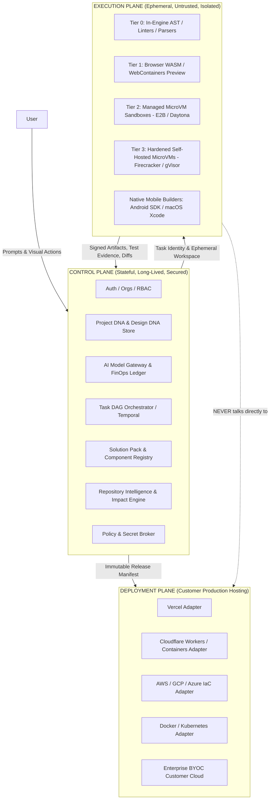

# OmniStackAI — AI Software Creation Operating System
## Master Architecture Specification & Competitive Operating Model (v7 Addendum)

**Status:** Implementation-Grade Specification & Architectural Reference  
**Parent Contract:** `R_&_D/OmniStackAI_Implementation_Brief_v6.md` (Sections 77 & 92 Normative)  
**Governance Hierarchy:** Section 0 & 3 of `AGENTS.md`  
**Date:** September 2026

---

### Executive Thesis

OmniStackAI operates as an **AI Software Creation Operating System**: a stateful engineering platform that compiles product intent into a strongly-typed **Project DNA**, understands existing repositories structurally, plans bounded work as a task DAG, executes untrusted workloads in isolated ephemeral sandboxes, applies small verified diffs, and deploys production software without runtime platform lock-in.

Competitor tools (Bolt, Lovable, v0, Dyad, Emergent) treat software creation as a single-prompt LLM code generator producing flat, repetitive UI prototypes. OmniStackAI differentiates by treating software creation as a **compilation problem over product intent across the full business ecosystem**.

---

## 1. The Three-Plane Separation (Foundational Architectural Invariant)

Everything in OmniStackAI belongs strictly to one of three isolated planes:



### Invariant Rules:
1. **Blast-Radius Containment:** The Execution Plane runs untrusted, LLM-generated code. It is treated as hostile by default. A compromise in a build sandbox cannot access control-plane databases, other tenant workspaces, or customer production secrets.
2. **Build Compute ≠ Hosting Compute:** Sandboxes scale to zero the moment tests or builds finish. Sandboxes never host production apps. Customer applications run on their own infrastructure (Vercel, Cloudflare, AWS, etc.) via generated `ReleaseManifest` packages.
3. **Provider Replaceability:** Sandbox runners (`ExecutionProvider`) and cloud model providers (`ModelProvider`) sit behind platform-owned interfaces. No vendor SDK leaks into product code.

---

## 2. Product Intelligence & Ecosystem Scope Compiler

Turns vague business prompts into an exact, confirmed ecosystem scope **before expensive LLM generation begins**, asking at most 1–3 high-materiality questions.

### The Problem in Existing Tools
When a user types *"Create a food delivery app"*, typical platforms generate only a single customer-facing screen. The user has to manually prompt for merchant menus, driver dispatch, and admin backoffices.

### The OmniStackAI Solution: 1-Click Ecosystem Proposal
The engine runs a two-stage classifier (Deterministic heuristics + Fast/cheap LLM classification) to detect the domain, business model, and required actors:

```
[ User Prompt: "Create a food delivery app" ]
                    │
                    ▼
       [ Fast Scope Classifier ]
                    │
                    ▼
 ┌────────────────────────────────────────────────────────────────────────┐
 │ DETECTED ECOSYSTEM: Food Delivery Marketplace                          │
 │                                                                        │
 │ Select initial build scope (editable at any time):                     │
 │                                                                        │
 │ ◉ Complete Business Platform (Recommended)                             │
 │   • Customer Web App + Mobile PWA (Ordering & Tracking)                │
 │   • Merchant Web Portal (Menu Management & Order Lifecycle)            │
 │   • Driver Dispatch Portal (Order Acceptance & Status)                 │
 │   • Super-Admin Dashboard (Platform Ops, Commission, Analytics)        │
 │                                                                        │
 │ ○ Customer Experience Only                                             │
 │   • Customer ordering menu, cart, and checkout.                        │
 │                                                                        │
 │ ○ Custom / Multi-Surface Configuration [Expand ▾]                      │
 └────────────────────────────────────────────────────────────────────────┘
```

- **Materiality Filter:** Questions are asked only if the answer fundamentally alters the database schema, compliance rules, or multi-app architecture. Non-material questions are defaulted sensibly into Project DNA.

---

## 3. Project DNA Engine (Single Source of Truth)

Conversations are evidence; **Project DNA (`ProjectSpec`) is the authoritative product state**.

- Every feature, screen, actor, entity, and permission is recorded in an immutable, versioned JSON/JSONB document.
- Downstream coding agents read typed specs instead of re-interpreting conversational history. This eliminates prompt drift, hallucinated requirements, and context-window degradation.
- All modifications emit `project.dna.updated` events with atomic JSON patches.

---

## 4. Style-DNA & Controlled Design Variation Engine

Solves the **"Every generated app looks identical"** problem that plagues competitors like v0 and Bolt.

### 1. Industry Design Archetypes
The platform maintains curated, production-tested visual design rules keyed by industry:

- **FinTech:** High data density, restrained neutral slate/navy palettes, strong tabular numeric typography, explicit security/status badges.
- **Healthcare:** Calm spacing, high contrast, WCAG-AAA accessibility, low cognitive load, empathetic feedback cues.
- **Agriculture:** High-contrast sunlight readability, map/GIS focus, card grids, offline-sync indicators.
- **E-Commerce:** Image-forward merchandising, fast product filtering, sticky purchase drawers, editorial typography pairings.
- **Logistics & Delivery:** Real-time map hierarchy, status pills, exception emphasis, operational density.

### 2. Controlled Variation Engine
When generating a new application, the engine uses a deterministic project seed across 6 independent design axes:
1. **Layout Family:** Split-pane, sidebar-rail, modular grid, or command-centric.
2. **Surface Language:** Clean bordered, layered elevation, tactile, or subtle frosted glass.
3. **Shape & Radius:** Sharp geometric (2px), modern rounded (8px), or capsule accents (9999px).
4. **Typography Pairing:** Neo-grotesk (Inter/Roboto), Editorial Serif (Playfair/Geist), or Technical Monospace.
5. **Density Rhythm:** Compact data-dense vs. comfortable spacious.
6. **Motion & Feedback:** Utility-fast, elastic micro-interactions, or reduced-motion.

### 3. Decoupled Semantic Token Architecture
Design tokens are completely isolated from business logic:
$$\text{Primitive Token} \longrightarrow \text{Semantic Token} \longrightarrow \text{Component Token}$$
- If the user requests: *"Switch this to a luxury brand style"* or toggles Dark Mode, the platform **recompiles only the design tokens without re-generating backend APIs, data schemas, or screen logic**.

---

## 5. Solution Packs & Component Intelligence Registry (Token & Cost Optimization)

Full LLM regeneration is slow, expensive, and error-prone. OmniStackAI structures generation as:
$$\mathbf{Generated\ Application} = \mathbf{Base\ Solution\ Pack} + \mathbf{Declarative\ Configuration} + \mathbf{AI\ Delta}$$

1. **Solution Packs:** Pre-tested, versioned, multi-application starter solutions (e.g. `food-delivery-marketplace`, `b2b-saas`, `healthcare-clinic`). They supply verified monorepo skeletons, Next.js configs, Go/Python backends, and Dockerfiles for zero tokens.
2. **Component Intelligence Registry:** Pre-tested capability modules:
   - **Identity & RBAC:** Passkeys, OAuth, session management, role guards.
   - **Commerce & Billing:** Stripe subscriptions, usage-based metering, invoices.
   - **Realtime & Maps:** Geolocation, order status tracking, WebSockets.
   - **Data Grids:** Server-side pagination, sorting, search, CSV/JSON export.
3. **AI Delta Generation:** The LLM generates **only the custom business models and differentiated UI features**. This cuts token consumption by **70% to 85%** and reduces generation latency from minutes to seconds.

---

## 6. Tiered Execution Router & Sandbox Architecture

Execution must be safe, fast, and economical. The platform routes commands across 4 distinct tiers:

| Tier | Environment | Workload | Latency | Server Cost |
| :--- | :--- | :--- | :--- | :--- |
| **Tier 0** | **In-Engine (No VM)** | Code diffs, Tree-sitter AST parsing, schema checks, formatters. | 0 ms | $0.00 |
| **Tier 1** | **Browser / WASM** | Client-side Next.js/React rendering, UI previews, Pyodide scripts. | < 50 ms | $0.00 |
| **Tier 2** | **Managed MicroVMs** | Package installs, backend builds, migrations, integration tests (E2B / Daytona). | < 200 ms | Pay-per-active-second (~$0.16/hr) |
| **Tier 3** | **Hardened Self-Hosted** | Enterprise BYOC, persistent background jobs, custom kernels (Firecracker / gVisor). | Warm pool | Host compute only |

### Sandboxing Governance Rules:
- **Scale to Zero:** Sandboxes are terminated or suspended immediately upon task completion. Sandboxes are never kept idle while awaiting user prompts.
- **Content-Addressable Cache:** Dependencies (`node_modules`, Go module cache) are cached by lockfile digest, eliminating repeated network downloads.
- **Zero Raw Secrets:** Sandboxes never receive permanent production credentials. The platform's **Secret Broker** injects short-lived, task-scoped capability tokens at the network proxy layer.

---

## 7. Next-Generation Adaptive Builder Workspace

Replaces basic chat-and-preview interfaces with a cohesive, developer-grade workspace:

1. **Multi-App Ecosystem Switcher:** Easily toggle between Customer Web, Merchant Portal, Courier App, and Admin Panel within a single browser tab.
2. **Visual Click-to-Edit Bridge:** Clicking any UI element in the live preview resolves its source component ID, allowing users to issue targeted styling or behavior prompts directly.
3. **Role & Persona Simulator:** Test applications live as an unauthenticated guest, a verified customer, or a platform super-admin with mock credentials.
4. **Transparent Task Inspector:** Real-time visibility into the task DAG, impacted files, unit tests run, and accumulated compute costs.

---

## 8. Integration with Existing Workstreams & Founder Build Sequence

This architecture **preserves and enhances** our existing roadmap without breaking current contracts:

1. **Backward Compatibility:** All existing Stage 0 contracts, 998 unit tests, and the `Founder Build Sequence` remain authoritative and protected.
2. **Incremental Adoption:**
   - **Tasks R-307 through R-315:** Continue the codegen quality and design token layer (`EmptyState`, `SearchBar`, semantic token mappings).
   - **Stream B (Product Intelligence):** Wire the Intent & Scope Classifier into our task planner.
   - **Stream C (Solution Packs):** Register our existing verified targets (`minimal-blog`, `rideshare-favourites`) as baseline Solution Packs.
   - **Stream D (Execution Router):** Integrate browser Tier 1 previews alongside managed Tier 2 sandboxes.

This document serves as the architectural north star ensuring OmniStackAI achieves technical and operational leadership across the industry.
