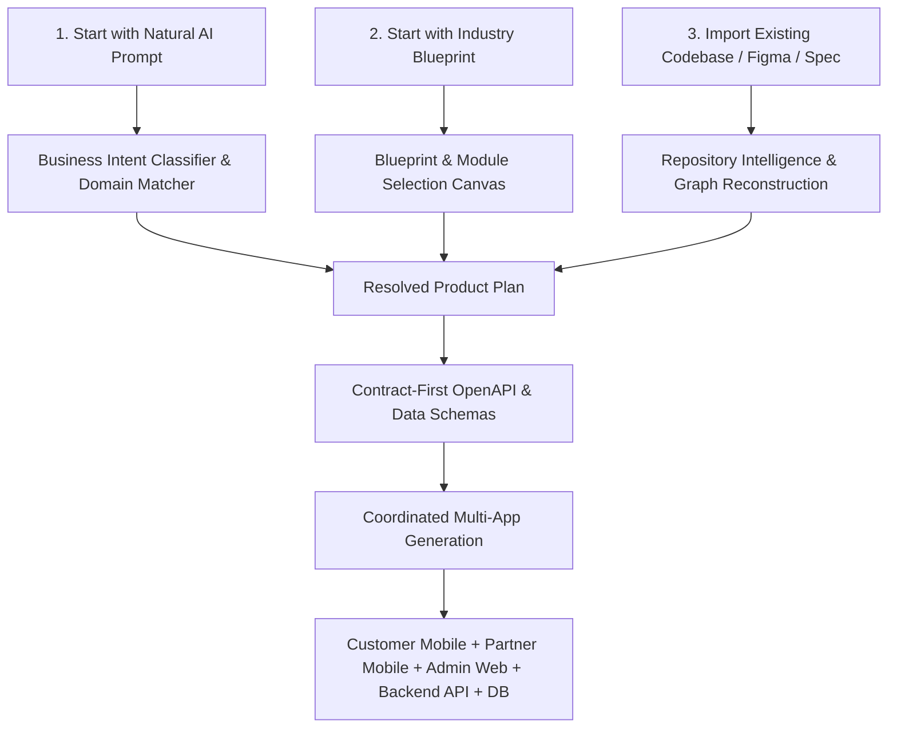
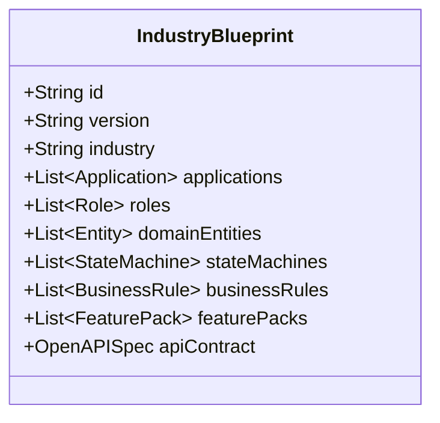
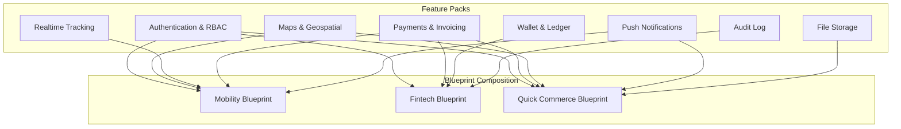
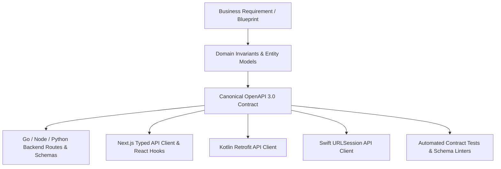

# OmniStackAI: Product Requirements Document (PRD) & Industry Blueprints Specification

**Document Version:** 1.0  
**Date:** 11 September 2026  
**Status:** Strategic Product Definition & Master Blueprint Specification  
**Classification:** Internal Confidential / Product & Engineering Contract  
**Companion Documents:**
- `R_&_D/OmniStackAI_Implementation_Brief_v6.md` (Technical Architecture Contract)
- `R_&_D/OmniStackAI_OS_Master_Architecture_Specification.md` (System Specification)
- `R_&_D/OmniStackAI_Execution_Tracker_v6.xlsx` (Roadmap & Verification Tracker)

---

## 1. Product Thesis & Strategic Positioning

### 1.1 The Core Product Thesis
> **Do not merely translate a prompt into isolated frontend code. Understand the business domain, select or compose the right industry architecture, generate the entire multi-application product ecosystem, and keep business logic, state machines, API contracts, data models, tests, and deployment synchronized as the project evolves.**

### 1.2 Core Differentiation Formula
$$\text{Core Differentiation} = \begin{aligned} &\text{Industry Intelligence} + \text{Architecture Intelligence} + \text{Business Logic Blueprints} \\ &+ \text{Multi-Application Ecosystems} + \text{Controlled Stack Flexibility} \\ &+ \text{True Native Mobile Development} + \text{Contract-First Engineering} \\ &+ \text{Continuous Project Evolution} \end{aligned}$$

### 1.3 Concise Product Promise
> **“One idea. Every application. Any stack.”**

### 1.4 Competitive Differentiation vs. the Market

Competitor platforms optimize around a single web or hybrid app, while OmniStackAI optimizes around **one product, many clients, one shared architecture**:

| Platform | Web Generation | Mobile Generation | Backend Strategy | True Native Mobile (Kotlin / Swift) | Multi-Application Ecosystem | Core Limitation |
|---|:---:|:---:|:---:|:---:|:---:|---|
| **Lovable** | Strong (Vite / TanStack Start) | ❌ Unsupported | Lovable Cloud / Supabase / APIs | ❌ None | ❌ Single web app only | Cannot build mobile apps; no true backend code ownership. |
| **Bolt.new** | Strong (WebContainers) | Expo (WebContainer) | In-browser Node.js | ❌ None | ❌ Single project container | In-browser container limits heavy multi-app and backend compilation. |
| **v0** | Industry leader in UI components | ❌ None | Next.js server actions | ❌ None | ❌ Single frontend project | Pure prompt-to-component/page; no multi-app ecosystem concepts. |
| **Emergent** | Yes | Expo / React Native | Python / FastAPI + MongoDB | ❌ None | Partial | Hard-locked into Expo + FastAPI + MongoDB; no native mobile; no stack choice. |
| **Dyad** | Yes | Capacitor hybrid (experimental) | Node.js | ❌ None | ❌ Single hybrid app | Webview wrapper; poor performance for driver/map/hardware intensive apps. |
| **OmniStackAI** | **Next.js (React)** | **React Native OR Native** | **Node.js, Python, or Go + PostgreSQL** | **✅ Kotlin/Compose & Swift/SwiftUI** | **✅ Coordinated Multi-App Ecosystem** | **Complete Software Engineering Operating System** |

---

## 2. Product Principles & Operating Model

1. **Architecture Before Code**: The platform resolves entities, lifecycles, service boundaries, and persistence models before generating line-by-line code.
2. **Business Logic Before UI**: An Industry Blueprint is a functional software system definition (state machines, rules, permissions, validations), not a collection of UI mockups.
3. **Blueprint Before Hallucination**: Proven domain architectures eliminate 80% of prompt ambiguity, reserving AI reasoning for the customer's unique 20% business differentiation.
4. **Contract-First API Architecture**: No client agent independently invents API shapes. A single canonical OpenAPI contract feeds the backend and all typed clients (web, iOS, Android).
5. **Multi-Application Coordination**: A single business request coordinates multiple applications (e.g. Customer App + Driver App + Admin Console + Marketing Site + Backend API).
6. **Controlled Stack Matrix**: Simple defaults for founders (Next.js + React Native + Node/NestJS + PostgreSQL), with controlled, production-certified native and backend choices for engineering teams.
7. **No Black Box & Full Code Ownership**: Customers own clean, idiomatic Git repositories with human-readable code, zero proprietary runtime lock-in, and full exportability.
8. **Reversible AI Editing**: All changes follow a Plan $\rightarrow$ Impact Analysis $\rightarrow$ Minimal AST Diff $\rightarrow$ Verification Gate loop with snapshot rollback.

---

## 3. Primary User Journeys

The platform exposes three first-class entry paths:



### 3.1 Path 1: Start with AI Prompt
1. User provides a business description: *"Build a ride-hailing platform in Dubai with customer app, driver app, admin dispatcher, card payments, and scheduled rides."*
2. **Intent Engine** classifies domain (`Mobility / Ride Hailing`), matches the **Mobility Blueprint**, and auto-selects:
   - Included apps: Customer App, Driver App, Admin Panel, Marketing Website.
   - Recommended modules: Scheduled rides, Driver KYC, Wallet, Realtime tracking, Surge pricing.
   - Recommended stack: React Native + Next.js + Node/NestJS + PostgreSQL.
3. User inspects the plan, customizes modules/stack if desired, and triggers generation.

### 3.2 Path 2: Start with Industry Blueprint
1. User browses the **Industry Blueprint Marketplace**.
2. Selects an industry (e.g., Quick Commerce, Healthcare, Fintech, B2B SaaS).
3. Toggles required applications, portals, and Feature Packs.
4. Selects Simple (Recommended) or Advanced technology stack.
5. Reviews architecture impact and generates.

### 3.3 Path 3: Import Existing Project
1. Ingests existing GitHub/GitLab repository, OpenAPI documentation, database schema, or Figma design.
2. Constructs the structural code graph (routes, endpoints, components, tables).
3. Allows adding a new client application (e.g. adding a Kotlin driver app to an existing web API), migrating stacks, or performing impact-safe AI feature extensions.

---

## 4. Industry Blueprint Engine & The 10 Core Blueprints

An Industry Blueprint is a versioned, machine-readable product architecture containing multiple applications, actor roles, domain entities, finite state machines, business rule engines, and verification suites.



### 4.1 Quick Commerce & Grocery Delivery
* **Typical Applications**:
  1. `customer-mobile`: Catalog discovery, search, cart, address/slot selection, live delivery tracking, wallet/checkout.
  2. `dark-store-app`: In-store picking checklist, barcode scanner, inventory adjustments, packing workflow.
  3. `delivery-partner-mobile`: Realtime order broadcast, acceptance, batch routing, turn-by-turn navigation, OTP delivery proof.
  4. `admin-web`: Multi-store inventory control, surge delivery fees, rider payout reconciliation, operational heatmaps.
  5. `marketing-web`: SEO landing pages, referral campaigns, promotional banners.
  6. `backend-api`: Realtime inventory locks, order dispatch queue, payment authorization, webhook handlers.
* **Order State Machine**:
  $$\text{Created} \rightarrow \text{Confirmed} \rightarrow \text{Picking} \rightarrow \text{Packed} \rightarrow \text{Rider Assigned} \rightarrow \text{Picked Up} \rightarrow \text{Out for Delivery} \rightarrow \text{Delivered}$$
  *(Branches: Item Substitution, Partial Refund, Customer Cancellation, Delivery Failed).*
* **Core Business Rules**: Slot capacity limits, out-of-stock substitution policy, maximum delivery radius, perishable goods refund policy.

### 4.2 Mobility & Ride-Hailing
* **Typical Applications**:
  1. `customer-mobile`: Pickup/dropoff geocoding, multi-stop ride setup, fare estimate, live driver tracking, split fare, in-app SOS.
  2. `driver-mobile`: Ride request radar, accept/reject, route deviation alerts, shift controls, earnings ledger, document uploads.
  3. `admin-dispatcher-web`: Live fleet map, manual dispatch override, zone pricing, driver KYC verification, dispute resolution.
  4. `corporate-portal`: Employee ride allowances, automated monthly invoicing, cost center tagging.
  5. `backend-api`: Geospatial driver matching, surge calculation, ride lifecycle state machine, payment hold/capture.
* **Ride State Machine**:
  $$\text{Requested} \rightarrow \text{Searching} \rightarrow \text{Driver Assigned} \rightarrow \text{Driver Accepted} \rightarrow \text{Driver Arriving} \rightarrow \text{Driver Arrived} \rightarrow \text{Ride Started} \rightarrow \text{Ride Completed}$$
  *(Branches: Rider Cancelled [with/without penalty], Driver Cancelled, No Show, Payment Failed, Route Disputed).*
* **Core Business Rules**: Driver search radius expansion (1km $\rightarrow$ 3km $\rightarrow$ 5km), cancellation fee grace window (2 mins), surge pricing multiplier ($1.0\times - 3.5\times$), platform commission split ($15\% - 25\%$).

### 4.3 Fintech & Digital Banking
* **Typical Applications**:
  1. `customer-mobile`: Double-entry wallet balance, P2P money transfer, QR merchant pay, virtual card management, statement export.
  2. `merchant-app`: Dynamic QR generation, point-of-sale terminal, settlement requests, transaction history.
  3. `admin-compliance-web`: AML transaction monitoring, suspicious activity reports, manual account freeze, tier limits management.
  4. `backend-api`: ACID transaction ledger, idempotency keys, KYC verification webhooks, payment rails integration.
* **Transaction State Machine**:
  $$\text{Initiated} \rightarrow \text{AML Evaluated} \rightarrow \text{Funds Reserved} \rightarrow \text{Executing} \rightarrow \text{Settled}$$
  *(Branches: AML Flagged, Insufficient Funds, Expired, Chargeback Disputed, Reversed).*
* **Core Business Rules**: Daily transfer velocity limits, tier-based KYC transaction caps, double-entry ledger balance invariants ($\sum \text{debits} = \sum \text{credits}$).

### 4.4 Health & Telemedicine
* **Typical Applications**: `patient-mobile`, `doctor-portal-web`, `clinic-admin-web`, `pharmacy-dashboard`, `backend-api`.
* **Appointment State Machine**:
  $$\text{Requested} \rightarrow \text{Confirmed} \rightarrow \text{Checked In} \rightarrow \text{In Consultation} \rightarrow \text{Prescription Issued} \rightarrow \text{Completed}$$
* **Core Modules**: WebRTC video consultation, EHR/prescriptions, slot booking, HIPAA/GDPR consent trails, lab result uploads.

### 4.5 EdTech & Learning Platforms
* **Typical Applications**: `student-mobile-web`, `instructor-studio-web`, `parent-portal-mobile`, `admin-web`, `backend-api`.
* **Core Modules**: Course video player, interactive quizzes, certificate generation, drip content scheduling, progress tracking.

### 4.6 Real Estate & Property Marketplace
* **Typical Applications**: `buyer-tenant-mobile`, `host-landlord-portal`, `agent-mobile`, `brokerage-admin`, `backend-api`.
* **Core Modules**: Geospatial listing search, virtual tour embedding, visit booking calendar, digital offer submission, lease agreements.

### 4.7 On-Demand Home Services
* **Typical Applications**: `customer-mobile`, `service-professional-mobile`, `franchise-portal-web`, `admin-web`, `backend-api`.
* **Job State Machine**:
  $$\text{Requested} \rightarrow \text{Quoted} \rightarrow \text{Assigned} \rightarrow \text{En Route} \rightarrow \text{Job Started} \rightarrow \text{Completed} \rightarrow \text{Invoiced} \rightarrow \text{Paid}$$

### 4.8 B2B Logistics & Freight Supply Chain
* **Typical Applications**: `shipper-portal-web`, `driver-mobile`, `fleet-manager-portal`, `warehouse-scanner-app`, `backend-api`.
* **Core Modules**: Multi-stop route optimization, QR/barcode bill of lading scanning, electronic proof of delivery (e-signature), weight/volume calculations.

### 4.9 Beauty, Salon & Wellness
* **Typical Applications**: `client-booking-mobile`, `stylist-schedule-app`, `salon-pos-tablet`, `admin-web`, `backend-api`.
* **Core Modules**: Staff availability calendar, service duration stacking, tip calculation, membership packages, product inventory.

### 4.10 B2B SaaS & Enterprise Workflow
* **Typical Applications**: `main-saas-web`, `mobile-companion-app`, `admin-portal`, `super-admin-billing`, `documentation-portal`, `backend-api`.
* **Core Modules**: Multi-tenant workspace isolation, granular RBAC, team invite workflows, Stripe subscription tiers, usage metering, audit logging, SSO.

---

## 5. Feature Pack Architecture (Reusable Building Blocks)

Blueprints are assembled from reusable, stack-aware **Feature Packs**:



### 5.1 Stack-Aware Feature Pack Matrix
Every Feature Pack defines a single logical capability implemented across each supported framework:

| Feature Pack | React Native (Expo) | Android Native (Kotlin) | iOS Native (Swift) | Backend (Go / Node / Python) |
|---|---|---|---|---|
| **Push Notifications** | `expo-notifications` | `FirebaseMessagingService` | `UNUserNotificationCenter` | Firebase Admin SDK / APNs HTTP2 |
| **Secure Storage** | `expo-secure-store` | Android `EncryptedSharedPreferences` / Keystore | iOS `Keychain` wrapper | Vault / KMS Environment Broker |
| **Live Geolocation** | `expo-location` | Google Play `FusedLocationProviderClient` | Apple `CLLocationManager` | PostGIS geospatial queries |
| **Payments** | `@stripe/stripe-react-native` | Stripe Android SDK / Google Pay | Stripe iOS SDK / Apple Pay | Stripe / Adyen / Razorpay backend API |
| **Camera & QR** | `expo-camera` / Native SVG | CameraX + ZXing / Native SVG | AVFoundation + CoreImage / SVG | Server-side QR/barcode generator |
| **Biometrics** | `expo-local-authentication` | Android `BiometricPrompt` | iOS `LAContext` (FaceID/TouchID) | WebAuthn / Passkey server validation |

---

## 6. Technology Stack Strategy & Controlled Matrix

To guarantee 100% build, test, and runtime success, OmniStackAI enforces an **opinionated, certified technology matrix** rather than an uncontrolled language explosion:

```
┌─────────────────────────────────────────────────────────────────────────────┐
│ 1. SIMPLE MODE — RECOMMENDED (Single-Click Generation)                      │
├─────────────────┬───────────────────────────────────────────────────────────┤
│ Web Application │ Next.js 14+ (App Router, TypeScript, Vanilla CSS Tokens)  │
│ Mobile (Apps)   │ React Native (Expo SDK, TypeScript)                       │
│ Backend API     │ Node.js (NestJS) OR Go (Standard net/http + Chi)          │
│ Database        │ PostgreSQL (pgvector, JSONB, ACID transactions)           │
│ Realtime        │ WebSocket / Server-Sent Events (SSE)                      │
│ Cache & Queues  │ Redis / Valkey                                            │
├─────────────────┴───────────────────────────────────────────────────────────┤
│ 2. ADVANCED MODE — CONTROLLED CHOICES (Per-Application Granularity)         │
├─────────────────┬───────────────────────────────────────────────────────────┤
│ High-Perf Mobile│ Android: Kotlin + Jetpack Compose                         │
│                 │ iOS: Swift + SwiftUI                                      │
│ Backend Options │ Go (high concurrency), Python / FastAPI (AI/data-heavy)   │
│ Database Option │ MongoDB (document-heavy catalogs without ACID joins)      │
└─────────────────┴───────────────────────────────────────────────────────────┘
```

### 6.1 Mixed-Stack Monorepo Execution
Because applications communicate through the central OpenAPI contract, a project can cleanly mix stacks:
* **Customer App**: React Native (fast cross-platform iteration).
* **Driver App**: Native Kotlin/Compose (unrestricted background GPS location tracking).
* **Admin Portal**: Next.js (rich data grids, dashboards, SEO).
* **Backend API**: Go (sub-millisecond geospatial driver matching).
* **Database**: PostgreSQL with PostGIS.

---

## 7. Contract-First API Architecture

No AI agent may invent arbitrary API endpoints or fields. All client and backend code must compile against the shared contract:



### 7.1 Cross-App Field Naming Enforcement
The contract enforces strict canonical naming rules across all platforms:
* API Wire Format: `snake_case` JSON fields (e.g. `driver_id`, `pickup_latitude`).
* TypeScript/Web: `camelCase` mapped types via generated interfaces.
* Kotlin/Android: `@SerializedName("driver_id") val driverId: String`.
* Swift/iOS: `let driverId: String` with `CodingKeys` mapping.
* This completely eliminates the common bug where Android expects `driver_id` while iOS sends `driverId` and the backend expects `driver_uuid`.

---

## 8. Multi-Application Project Structure (Monorepo Standard)

All applications, shared contracts, and infrastructure reside in a single organized monorepo:

```
my-platform/
├── product.yaml                     # Machine-readable resolved Product Blueprint
├── contracts/
│   ├── openapi.json                 # Canonical OpenAPI 3.0 specification
│   └── events.json                  # Async event definitions (NATS / Redis)
├── apps/
│   ├── customer-mobile/             # React Native (Expo) app
│   ├── driver-mobile/               # Native Android (Kotlin/Compose) app
│   ├── admin-web/                   # Next.js 14 admin portal & dispatcher
│   └── marketing-web/               # Next.js 14 SEO marketing site
├── services/
│   └── api/                         # Central Backend service (Go or Node or Python)
│       ├── migrations/              # PostgreSQL sequential SQL migrations
│       └── app/                     # Domain modules, repositories, handlers
├── packages/
│   ├── design-tokens/               # Central CSS variables, typography, colors
│   └── generated-client/            # Auto-generated typed API SDKs
├── infrastructure/
│   ├── docker-compose.yml           # Local dev orchestrator (DB, Redis, API)
│   └── ci/                          # GitHub Actions / GitLab CI pipelines
└── docs/
    ├── architecture/                # Auto-generated architecture diagrams
    └── adr/                         # Architecture Decision Records (ADRs)
```

---

## 9. Safe AI Editing, Code Ownership & Migration

### 9.1 The Plan $\rightarrow$ Impact $\rightarrow$ Apply $\rightarrow$ Verify Loop
When a user requests a change (*"Add wallet payments to ride-hailing"*):
1. **Impact Engine**: Scans the code graph and identifies affected surfaces:
   - Database: new `wallets` table, `0003_add_wallets.sql` migration.
   - Backend: `/wallets/topup`, `/wallets/balance` endpoints.
   - OpenAPI Contract: updated schemas and response models.
   - Customer App: Wallet payment selection in checkout sheet.
   - Admin Portal: Driver payout ledger table.
2. **Impact Review**: User sees the exact blast radius before execution begins.
3. **Execution**: Generates targeted AST patches.
4. **Verification**: Executes `task verify` (compilation, unit tests, contract tests).
5. **Reversible Commit**: Creates a clean Git checkpoint.

### 9.2 Three-Tier Code Ownership
* **AI Managed**: Generated screens and boilerplate that the AI can refactor automatically.
* **Developer Managed**: Custom business algorithms or manual edits that the AI is forbidden from overwriting without explicit permission.
* **Protected Region**: File sections marked with `// OMNISTACKAI:PROTECTED_START ... // OMNISTACKAI:PROTECTED_END` which the agent preserves verbatim.

### 9.3 Stack Migration Capability
Because business logic, state machines, and API contracts are preserved in `ApplicationIR` and OpenAPI:
* A startup can launch their MVP with **React Native** for both apps.
* When their driver fleet grows to 50,000 drivers, the user requests: *"Migrate the Driver App to native Kotlin/Compose."*
* The engine regenerates **only** `apps/driver-mobile/` in Kotlin/Compose against the existing OpenAPI contract. The customer app, admin web, backend API, and PostgreSQL database remain 100% untouched.

---

## 10. Requirement Register & Verification Gates

| ID | Priority | Requirement | Success Criteria |
|---|:---:|---|---|
| **PLT-001** | P0 | Multi-App Product Workspace | Generates customer mobile, partner mobile, admin web, and backend in one monorepo sharing one data model. |
| **PLT-002** | P0 | Three Entry Paths | User can start from an AI prompt, select an Industry Blueprint, or import an existing repository. |
| **PLT-003** | P0 | Partial Regeneration | Agent can regenerate a single screen, endpoint, or client application without touching unrelated code. |
| **BLP-001** | P0 | Business-Logic Blueprints | Blueprints encode domain entities, state machines, business rules, and API contracts—not just UI screens. |
| **BLP-002** | P1 | Blueprint Versioning | Projects record blueprint origin version (`blueprint.lock`) and allow safe, non-destructive upstream upgrades. |
| **FTR-001** | P0 | Feature Pack Composition | Capability modules (Auth, Payments, Maps, Chat, Wallet) are composed into Blueprints with dependency checks. |
| **API-001** | P0 | Contract-First API | A single versioned OpenAPI spec governs the backend and all client code. 0 client-side endpoint invention. |
| **API-002** | P0 | Typed Client Generation | Stack-appropriate typed API clients are generated automatically for Next.js, React Native, Kotlin, and Swift. |
| **STK-001** | P0 | Opinionated Default Stack | Generates Next.js + React Native + Node/NestJS or Go + PostgreSQL cleanly out-of-the-box. |
| **STK-002** | P1 | Controlled Native Choices | Allows selecting Kotlin/Compose (Android) and Swift/SwiftUI (iOS) per application in Advanced Mode. |
| **AI-001** | P0 | Architecture Planning | Generates inspectable architectural plan and entity diagrams before executing code generation. |
| **AI-002** | P0 | Impact Analysis | Material changes calculate affected files, database migrations, endpoints, and tests prior to code mutation. |
| **AI-003** | P0 | Git Reversibility | All changes are grouped into human-readable Git commits with instantaneous snapshot rollback. |
| **OWN-001**| P0 | Complete Code Ownership | User receives standard, idiomatic code in an owned Git repository with 0 runtime lock-in. |

---

## 11. Roadmap Phasing & Alignment

OmniStackAI's 383-task execution tracker aligns with this Master Specification across four stages:

```
[OmniStackAI Execution Timeline]
Phase 1: BASIC / MVP (In Progress — 172 Tasks Done, 105 Remaining)
  ✓ Application IR v4 & Contract-First OpenAPI Generator
  ✓ 50+ Zero-Dependency UI Components (Spreadsheets, QR, Terminals, Flowcharts, etc.)
  ✓ Next.js 14 + Python/Go API + PostgreSQL Monorepo Builder
  ✓ Automated Quality Gates (task verify, task lint, secret policies, 2,193 tests)
  → Next: Industry Blueprint Catalog (Mobility, Quick Commerce, SaaS), React Native / Expo adapter.

Phase 2: MID (47 Tasks)
  → Kotlin/Jetpack Compose & Swift/SwiftUI native adapters.
  → Streamed in-browser Android Emulators & iOS Simulators.
  → Existing repository import & code graph indexing (Tree-sitter).
  → Automated TestFlight & Google Play publishing pipelines.

Phase 3: ADVANCED (29 Tasks)
  → Hardened microVM runner fleets (E2B / Daytona).
  → Cross-stack migration engine (RN → Kotlin, Node → Go).
  → Private BYOC runners & private model endpoints.
  → Enterprise multi-repo synchronization.

Phase 4: PRODUCTION (29 Tasks)
  → Multi-region high availability & automated disaster recovery drills.
  → Enterprise SOC 2 compliance, policy-as-code, and two-person approval gates.
  → SLA enforcement and positive unit-economics validation.
```

---

## 12. Strategic Summary: The OmniStackAI Moat

The long-term winner in AI software engineering will not be the tool that creates the prettiest single webpage. It will be the platform that:
1. **Understands the complete business model** through structured Industry Blueprints.
2. **Generates every required application** (consumer, worker, admin, backend, database) in a synchronized monorepo.
3. **Guarantees cross-client correctness** through Contract-First API enforcement.
4. **Supports true native performance** in Kotlin and Swift when products scale beyond cross-platform MVPs.
5. **Gives complete code ownership** to the customer without vendor lock-in.

This specification serves as the permanent product contract for OmniStackAI's engineering agents and human development team.
